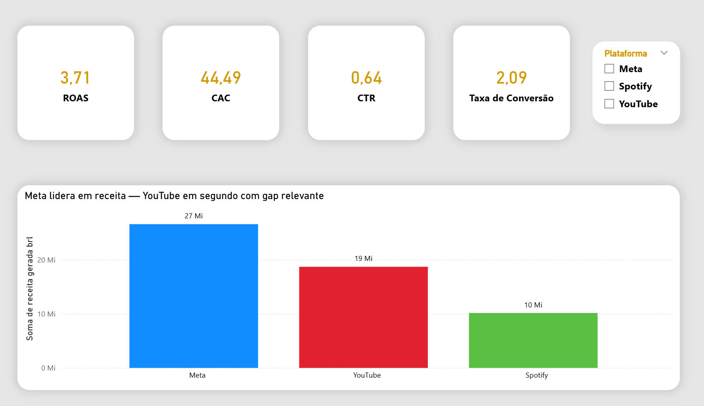
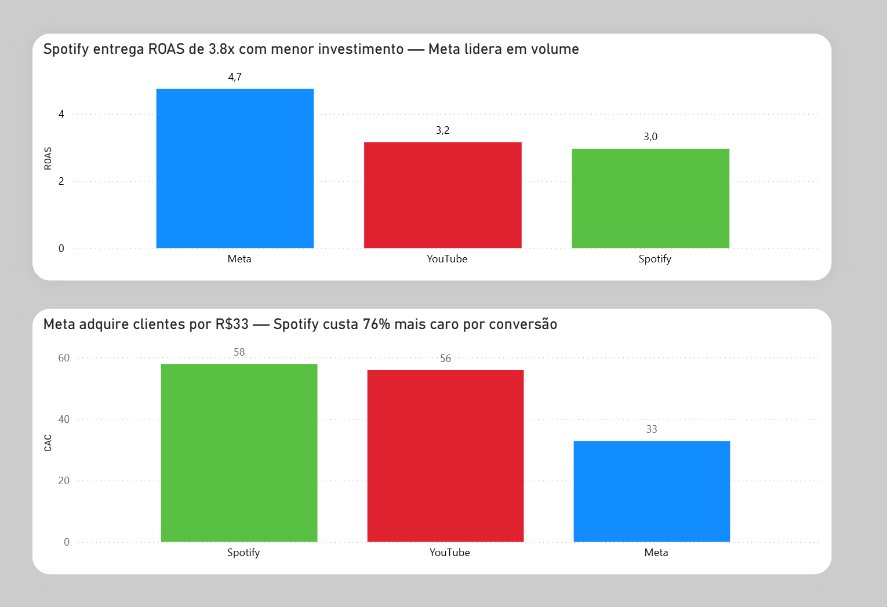
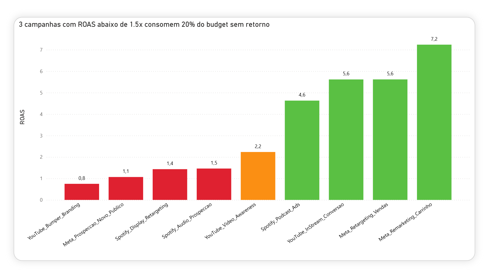

# Case Marketing — Análise de Performance de Campanhas

## Contexto
O case analisa o desempenho de campanhas de marketing pago, olhando a evolução em 3 frentes — Meta, YouTube e Spotify — e com esses insights entender qual campanha está performando melhor e otimizar para ter o melhor resultado possível.

## Pergunta de Negócio
> "Quais campanhas de Meta, YouTube e Spotify entregam melhor retorno sobre investimento, e como redistribuir o orçamento para maximizar conversões e reduzir o CAC?"

## Ferramentas
- MySQL — extração e análise dos dados
- Power BI — visualização e dashboard

## Links
- [Portfólio no Notion](https://www.notion.so/Case-Marketing-3408f115aff580cdb207da8d9e8d8cb6)
- [Repositório GitHub](https://github.com/lucassdolci/Case-Marketing)

## Estrutura do Projeto
- `data/` — dataset simulado de campanhas (18 linhas × 9 colunas)
- `queries/` — análises em SQL organizadas por tema
- `dashboard/` — arquivo Power BI
- `docs/` — insights e recomendações

## Dashboard

### Visão Geral — KPIs Consolidados

ROAS consolidado de 3,71x com CAC médio de R$44. Meta lidera em receita gerada com R$27Mi no período analisado.

### Performance por Plataforma — ROAS e CAC

Meta apresenta o melhor ROAS (4,7x) e menor CAC (R$33). Spotify surpreende com ROAS competitivo (3,0x) mesmo com menor investimento. YouTube tem o CAC mais alto do portfólio (R$56).

### Campanhas Ruins — Ranking por ROAS

3 campanhas com ROAS abaixo de 1,5x consomem 20% do budget sem retorno adequado. YouTube Bumper Branding tem o pior desempenho com ROAS de 0,8x.

## O que os dados mostraram
Tínhamos 3 campanhas com ROAS muito abaixo de 1,5x, que estavam gerando muito prejuízo no budget. O Meta teve um desempenho muito positivo entre os 3 veículos, com ROAS de 4,7x e o menor CAC do portfólio — R$33. O YouTube gerou a pior performance, com as campanhas Bumper apresentando ROAS de 0,8x — cada R$1 investido retornou apenas R$0,80, consumindo budget sem gerar conversão real. Já o Spotify trouxe resultados que não esperava: os Podcast Ads entregaram ROAS de 4,6x, semelhante ao Meta, mesmo sendo uma plataforma que costuma ter média de entrega naturalmente mais baixa, mostrando um potencial escondido onde é possível trabalhar e ter resultados consideráveis além do Meta.

## Recomendações
Cortar as 3 campanhas ruins, dobrar no remarketing da Meta e escalar os Podcast Ads do Spotify. Além disso, levantar um estudo com a equipe de mídia — em paralelo às campanhas que estão boas rodando — para entender onde está o ponto focal negativo no YouTube e otimizar as campanhas para ter resultado nesse veículo também.

## Análises Realizadas

| Arquivo | Descrição |
| --- | --- |
| 01_queries_geral_analise | Visão geral consolidada de todas as campanhas |
| 02_receita_investimento_por_plataforma | Receita e investimento agrupados por plataforma |
| 03_cac_por_campanha | Custo de aquisição de cliente por campanha |
| 04_roas_por_campanha | Retorno sobre investimento por campanha |
| 05_ctr_por_campanha | Taxa de cliques por campanha e plataforma |
| 06_ranking_campanhas_ruins | Score de ineficiência e recomendação de corte |
